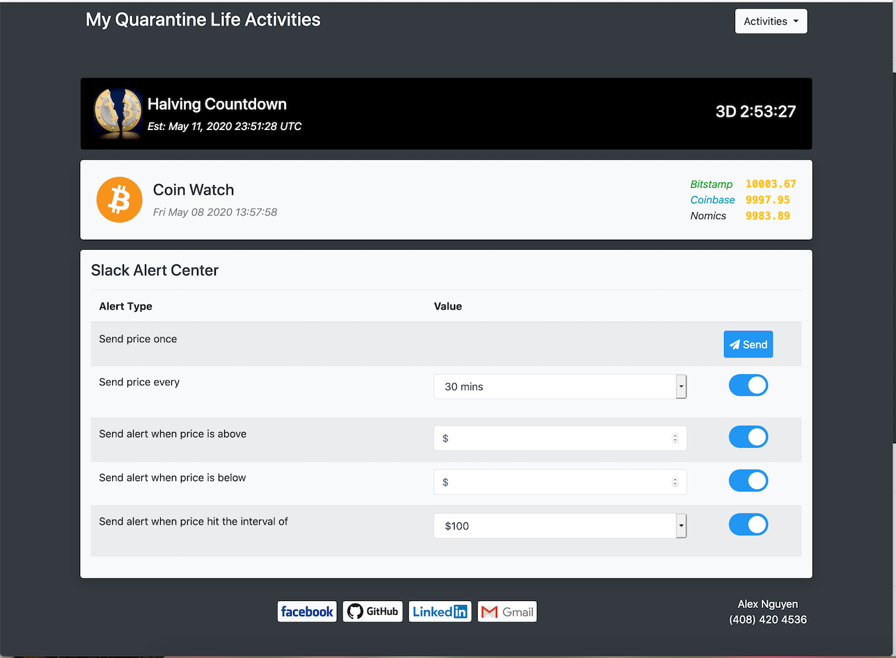

# Rest - Spring Boot - CodeIgnitor
(On going project)
As I get bored of the Coronavirus pandemic quanrantine, I will make a webpage to Monitoring BITCOIN price and keep track of all my daily activites

## Feature:
1. Monitoring my daily water drinking. (done)
2. Count how many time I have opened the fridge today. (not yet implemented)
3. Monitoring BITCOIN price including: (done)
-  Displaying current price, halving countdown 
-  Schedule alarm to send Slack message when Bitcoin price reach some certain price.
4. Music player, which streaming: (not yet implemented)
-  Online radio station. 
- ...

## Project Framworks:
  - Front End written in PHP, Javascript, HTML, CSS using CodeIgnitor frameworks
  - Back End written in Java, MySQL using Spring Boot frameworks.
  
## Current FrontEnd snapshot




## To Run the Project:
  Assuming LAMP Stack already installed on your computer. See [tutorial of installing LAMP](https://www.digitalocean.com/community/tutorials/how-to-install-linux-apache-mysql-php-lamp-stack-ubuntu-18-04) <br/>
  Recommend using Firefox with CORS Add On to avoid CORS error since this is a localhost development project.
  1. Start mysql server from terminal: <br/>
    ```mysql.server start```
  2. Start apache from terminal:<br/>
    ```sudo apachectl start```
  3. Run clean server by navigating into the backend folder and run: <br/>
    ``` ./mvnv clean spring-boot:run ```
  4. Depending on where your project at, the url to the website should be similar to: <br/>
    ``` localhost/paths-to-project-folder/RestSpring/FronEnd/ ```

## Resource:<br/>
[Tutorial - Building REST services with Spring following](https://spring.io/guides/tutorials/rest/) <br/>
[Tutorial - Spring with MySQL](https://spring.io/guides/gs/accessing-data-mysql/) <br/>
[tutorial of installing LAMP](https://www.digitalocean.com/community/tutorials/how-to-install-linux-apache-mysql-php-lamp-stack-ubuntu-18-04) <br/>
[Tool - Add on to Disable CORS in Mozilla FireFox](https://addons.mozilla.org/en-US/firefox/addon/cors-everywhere/)<br/>
[Tool - Cron job](https://medium.com/better-programming/https-medium-com-ratik96-scheduling-jobs-with-crontab-on-macos-add5a8b26c30) <br/>
[API - Nomics Crypto data](http://docs.nomics.com)<br/>
[API - Bitstamps Crypto data](https://www.bitstamp.net/api/)<br/>
[API - Coinbase Crypto data](https://api.coinbase.com/v2/)<br/>
[API - Slack webhooks to send message](https://api.slack.com/tutorials/slack-apps-hello-world)<br/>

  
  
